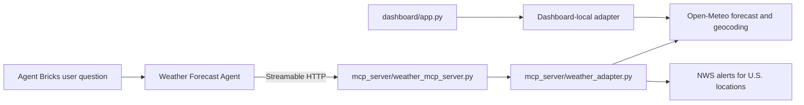

# Weather Forecast MCP Server + Agent

Day 3 homework submission for building a weather agent with a FastMCP server,
Databricks Apps, and an Agent Bricks external MCP tool.

## What is included



- `mcp_server/weather_mcp_server.py` exposes seven FastMCP tools with
  `@mcp.tool` decorators and Streamable HTTP transport.
- `mcp_server/weather_adapter.py` contains every HTTP call, location resolver,
  WMO code mapping, response normalization, threshold rule, and error message.
- `agent/` contains the Agent Bricks system prompt, external MCP handoff
  config, tool manifest, and evaluation prompts.
- `dashboard/` is the optional second Databricks App. It shows a query form,
  latest recommendation, loading state, error state, empty state, and recent
  in-process prediction history.
- `tests/` covers location resolution, current conditions, derived umbrella
  logic, historical lookup, and clean invalid-date handling without network
  calls.
- `evidence/sample_runs.md` records three natural-language agent examples with
  tool calls and final answers.

## Deployed workspace resources

The implementation has been deployed and tested in the Databricks workspace
used for this submission:

- MCP Databricks App: `weather-forecast-mcp`
- MCP endpoint: `https://weather-forecast-mcp-7474655808298242.aws.databricksapps.com/mcp`
- Unity Catalog MCP Service: `workspace.default.weather_forecast_mcp`
- Agent Bricks Supervisor Agent: `Weather Forecast Agent`
- Agent resource: `supervisor-agents/705694e8-f370-4269-aeb4-3972e61a761f`
- Agent endpoint: `mas-705694e8-endpoint`
- Optional dashboard App: `weather-forecast-dashboard`

The MCP service exposes all seven tools. The Agent Bricks agent is configured
with the system prompt in `agent/system_prompt.md` and uses the registered
Unity Catalog MCP Service as its tool source. No Databricks token or secret is
stored in this repository.

Connection authentication note: the workspace connection was initially
validated with a short-lived OAuth bearer token from the authenticated CLI
profile. The token is stored only by Databricks in the connection and is not
committed here. Because bearer tokens expire, rotate this connection to a
durable U2M or M2M OAuth configuration before using the agent as a long-lived
service.

## Dashboard design direction

The optional dashboard reads as a technical operator surface rather than a
marketing page. Its design dials are `DESIGN_VARIANCE: 7`,
`MOTION_INTENSITY: 4`, and `VISUAL_DENSITY: 5`: an asymmetric split workspace,
restrained loading shimmer for state feedback, and enough density for forecast
signals without turning the page into a table. The page uses one dark slate
theme, one amber accent, one 14px radius scale, explicit mobile collapse rules,
and a reduced-motion fallback.

## Weather API and authentication

The primary source is [Open-Meteo](https://open-meteo.com/en/docs). It provides
worldwide geocoding and forecast data without an API key, so there are no
credentials to store or commit for the primary pipeline. The adapter requests
Fahrenheit temperatures, mph wind, automatic local time zones, current
conditions, and daily precipitation fields.

The severe-alert stretch tool uses the [National Weather Service alerts API](https://www.weather.gov/documentation/services-web-alerts)
for U.S. locations. It requires no key, but the adapter explicitly returns
`status="unsupported"` for non-U.S. locations rather than treating missing
coverage as no alert.

Historical lookups use the [Open-Meteo Historical Weather API](https://open-meteo.com/en/docs/historical-weather-api),
which is based on reanalysis data and is labeled as historical weather rather
than a direct station observation.

## Tools

| Tool | Purpose | Source |
| --- | --- | --- |
| `get_current_weather(location)` | Temperature, feels-like temperature, conditions, humidity, wind | Open-Meteo forecast |
| `get_forecast(location, days)` | Daily high/low, conditions, precipitation probability and amount, wind | Open-Meteo forecast |
| `predict_umbrella_needed(location, date)` | Applies a documented rain threshold and explains the result | Derived from forecast |
| `get_travel_recommendation(location, date)` | Combines rain, low temperature, and gust thresholds into packing advice | Derived from forecast |
| `get_severe_weather_alerts(location)` | Active alerts with U.S.-only coverage disclosure | NWS |
| `get_historical_weather(location, date)` | Past daily weather from reanalysis | Open-Meteo archive |
| `compare_weather(locations, date)` | Compares two to five locations and identifies the driest and warmest | Open-Meteo forecast |

The umbrella rule is intentionally simple and inspectable: recommend an
umbrella when the maximum precipitation probability is at least 40%, daily
precipitation is at least 0.3 mm, or the WMO condition code indicates rain,
snow, or thunderstorms. The tool returns the selected forecast day, the raw
signals, the rule, and a sentence explaining which signals fired.

## Run locally

Use Python 3.10 or newer.

```bash
cd day3-project/mcp_server
python -m venv .venv
source .venv/bin/activate
pip install -r requirements.txt
python weather_mcp_server.py
```

The MCP server uses FastMCP `transport="http"`, which is FastMCP's
Streamable HTTP transport. The endpoint is:

```text
http://127.0.0.1:8000/mcp
```

The port is read from `DATABRICKS_APP_PORT`, then `PORT`, and finally defaults
to `8000`.

Run the optional dashboard in a second terminal:

```bash
cd day3-project/dashboard
python -m venv .venv
source .venv/bin/activate
pip install -r requirements.txt
python app.py
```

Open `http://127.0.0.1:8001`. The dashboard is intentionally read-only and
keeps recent query history in process memory. Restarting the app clears the
history.

Run tests from `day3-project` after installing the test dependency:

```bash
python -m pip install pytest
pytest -q
```

## Deploy as Databricks Apps

The two subfolders are independent app sources, matching the Day 3 reference
pattern.

### 1. Deploy the MCP server

1. Put this repository in a Databricks Git folder.
2. Create a Custom Databricks App named something like
   `weather-forecast-mcp`.
3. Point the app source at `day3-project/mcp_server/`, so Databricks reads its
   `app.yaml` and `requirements.txt`.
4. Deploy and copy the app URL. The registered MCP endpoint is the app URL
   with `/mcp` appended if the workspace displays only the app root.
5. Confirm the app has the expected HTTP route before registering it. The
   primary Open-Meteo path does not require Databricks secrets.

### 2. Register the external MCP

In the workspace, open AI Gateway or the MCP registration surface, choose Add
MCP or Register external MCP, and enter the deployed endpoint. Use the name
`weather-forecast-mcp`, select Streamable HTTP, save, and grant the Agent Bricks
agent permission to use the registered MCP server.

The deployed service is `workspace.default.weather_forecast_mcp`, backed by
the App endpoint in the workspace resources section above. Do not commit a
workspace token or secret.

### 3. Build the Agent Bricks agent

1. Create a Supervisor Agent from the Agent Bricks Agents page, or create one
   with the Supervisor Agents API.
2. Add the registered `workspace.default.weather_forecast_mcp` MCP Service as
   a tool.
3. Select all tools from `agent/tool_manifest.json`, or start with the three
   required tools and add the stretch tools after the first evaluation.
4. Paste the contents of `agent/system_prompt.md` as the system prompt.
5. Use `agent/sample_prompts.json` as evaluation prompts.
6. Save the agent and run the examples in `evidence/sample_runs.md`.

### 4. Deploy the dashboard

Create a second Custom Databricks App pointed at
`day3-project/dashboard/`. Its `app.yaml` starts Flask on the Databricks app
port. The dashboard does not need API keys or a database for this optional
exercise.

## Guardrails and failure behavior

- Location resolution errors return `status="error"` with an actionable
  message, not a Python traceback.
- API timeouts, HTTP failures, and invalid JSON are converted to clean tool
  results. The system prompt tells the agent to report the failure rather than
  guess.
- The MCP server never makes raw HTTP calls inside a decorated tool function.
- The prompt requires current/future/past/comparison questions to use the
  corresponding tool family and forbids unsupported weather claims.
- NWS alert coverage is disclosed as U.S.-only.
- No API keys, Databricks tokens, or secret values are hardcoded anywhere in
  this submission.

## Submission checklist

- [x] FastMCP server with at least three decorated weather tools
- [x] Separate adapter module with all HTTP and parsing logic
- [x] Streamable HTTP server entrypoint, `requirements.txt`, and `app.yaml`
- [x] Agent Bricks system prompt, tool list, and registration steps
- [x] Three natural-language demonstrations with tool calls and answers
- [x] Stretch tools for alerts, historical weather, comparison, and travel advice
- [x] Optional dashboard app with responsive states and accessible form labels
